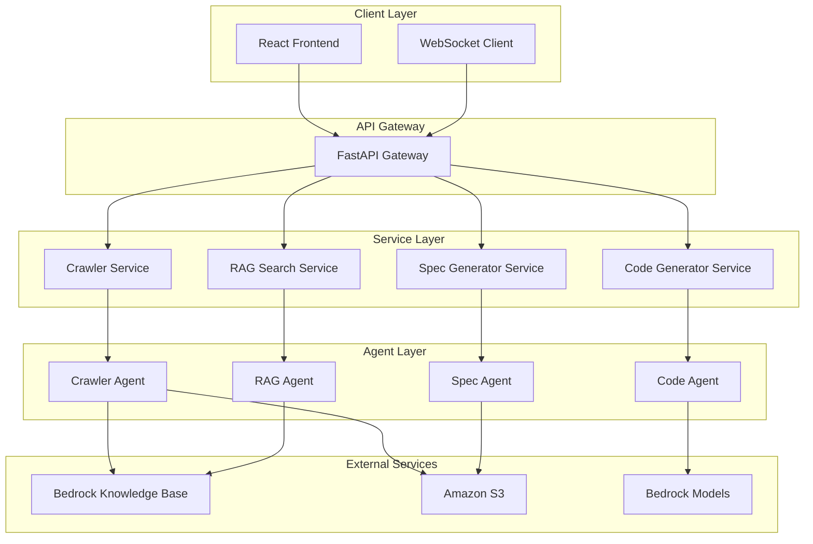

# API 문서 크롤링 및 Bedrock Knowledge Base 연동 시스템 설계 문서

## 1. 시스템 개요

### 1.1 아키텍처 패턴
- **Frontend**: SPA (Single Page Application) - React
- **Backend**: Microservices Architecture - FastAPI
- **Communication**: RESTful API + WebSocket
- **Data Flow**: Event-Driven Architecture
- **State Management**: Client-side (Zustand) + Server-side (Session)

### 1.2 시스템 구성도


## 2. 데이터베이스 설계

### 2.1 세션 관리 (Redis)
```json
{
  "session:{session_id}": {
    "id": "uuid",
    "currentStep": 1,
    "createdAt": "2024-01-01T00:00:00Z",
    "updatedAt": "2024-01-01T00:00:00Z",
    "status": "active",
    "data": {
      "step1": {...},
      "step2": {...},
      "step3": {...},
      "step4": {...}
    }
  }
}
```

### 2.2 작업 큐 (Redis)
```json
{
  "job:{job_id}": {
    "id": "uuid",
    "type": "crawl|search|generate|execute",
    "sessionId": "uuid",
    "status": "pending|processing|completed|failed",
    "progress": 0,
    "result": {},
    "error": null,
    "createdAt": "2024-01-01T00:00:00Z"
  }
}
```

### 2.3 파일 저장 구조 (S3)
```
s3://bucket-name/
├── sessions/
│   └── {session_id}/
│       ├── crawled_data/
│       │   ├── raw/
│       │   └── processed/
│       ├── specifications/
│       │   └── spec.md
│       └── generated_code/
│           ├── python/
│           └── javascript/
└── knowledge_base/
    ├── shopify/
    └── amazon_seller/
```

## 3. API 설계

### 3.1 RESTful API 명세

#### 3.1.1 세션 관리
```yaml
/api/v1/sessions:
  post:
    summary: 새 세션 생성
    responses:
      201:
        schema:
          type: object
          properties:
            sessionId: string
            currentStep: integer

/api/v1/sessions/{sessionId}:
  get:
    summary: 세션 정보 조회
  put:
    summary: 세션 정보 업데이트
  delete:
    summary: 세션 삭제
```

#### 3.1.2 Step 1: 데이터 입력
```yaml
/api/v1/crawl:
  post:
    summary: 크롤링 작업 시작
    requestBody:
      schema:
        type: object
        properties:
          sessionId: string
          urls: array
          options:
            type: object
            properties:
              depth: integer
              scope: string
    responses:
      202:
        schema:
          type: object
          properties:
            jobId: string
            status: string

/api/v1/upload:
  post:
    summary: 파일 업로드
    requestBody:
      content:
        multipart/form-data:
          schema:
            type: object
            properties:
              sessionId: string
              files: array
    responses:
      201:
        schema:
          type: object
          properties:
            uploadId: string
            files: array
```

#### 3.1.3 Step 2: API 탐색
```yaml
/api/v1/search:
  post:
    summary: RAG 기반 API 검색
    requestBody:
      schema:
        type: object
        properties:
          sessionId: string
          query: string
          context: array
    responses:
      200:
        schema:
          type: object
          properties:
            results: array
            suggestions: array

/api/v1/api/test:
  post:
    summary: API 테스트 실행
    requestBody:
      schema:
        type: object
        properties:
          sessionId: string
          apiInfo:
            type: object
            properties:
              endpoint: string
              method: string
              headers: object
              body: object
    responses:
      200:
        schema:
          type: object
          properties:
            success: boolean
            response: object
            error: string
```

#### 3.1.4 Step 3: 명세서 생성
```yaml
/api/v1/spec:
  post:
    summary: 명세서 생성
    requestBody:
      schema:
        type: object
        properties:
          sessionId: string
          apiData: object
          template: string
    responses:
      201:
        schema:
          type: object
          properties:
            specId: string
            content: string

  put:
    summary: 명세서 수정
    requestBody:
      schema:
        type: object
        properties:
          sessionId: string
          content: string
    responses:
      200:
        schema:
          type: object
          properties:
            success: boolean
```

#### 3.1.5 Step 4: 코드 생성
```yaml
/api/v1/code:
  post:
    summary: 코드 생성
    requestBody:
      schema:
        type: object
        properties:
          sessionId: string
          prompt: string
          language: string
          context: object
    responses:
      200:
        schema:
          type: object
          properties:
            code: string
            explanation: string

/api/v1/code/execute:
  post:
    summary: 코드 실행
    requestBody:
      schema:
        type: object
        properties:
          sessionId: string
          code: string
          language: string
          environment: object
    responses:
      200:
        schema:
          type: object
          properties:
            success: boolean
            output: string
            error: string
```

### 3.2 WebSocket API 명세

#### 3.2.1 연결 엔드포인트
```
/ws/session/{sessionId}
```

#### 3.2.2 메시지 형식
```typescript
// 클라이언트 → 서버
interface ClientMessage {
  type: 'subscribe' | 'unsubscribe' | 'chat' | 'execute';
  data: any;
}

// 서버 → 클라이언트
interface ServerMessage {
  type: 'progress' | 'result' | 'error' | 'chat_response';
  data: any;
  timestamp: string;
}
```

## 4. 프론트엔드 설계

### 4.1 컴포넌트 구조
```
src/
├── components/
│   ├── ui/                     # Shadcn/ui 기본 컴포넌트
│   │   ├── button.tsx
│   │   ├── input.tsx
│   │   ├── card.tsx
│   │   └── ...
│   ├── layout/                 # 레이아웃 컴포넌트
│   │   ├── Header.tsx
│   │   ├── Sidebar.tsx
│   │   ├── MainContent.tsx
│   │   └── Footer.tsx
│   ├── steps/                  # 단계별 컴포넌트
│   │   ├── Step1DataInput/
│   │   │   ├── index.tsx
│   │   │   ├── UrlInput.tsx
│   │   │   ├── FileUpload.tsx
│   │   │   └── CrawlProgress.tsx
│   │   ├── Step2ApiSearch/
│   │   │   ├── index.tsx
│   │   │   ├── ChatInterface.tsx
│   │   │   ├── ApiCard.tsx
│   │   │   └── TestPanel.tsx
│   │   ├── Step3SpecReview/
│   │   │   ├── index.tsx
│   │   │   ├── SpecEditor.tsx
│   │   │   ├── Preview.tsx
│   │   │   └── TemplateSelector.tsx
│   │   └── Step4CodeGen/
│   │       ├── index.tsx
│   │       ├── ChatInterface.tsx
│   │       ├── CodeEditor.tsx
│   │       └── ExecutionPanel.tsx
│   └── common/                 # 공통 컴포넌트
│       ├── ProgressBar.tsx
│       ├── LoadingSpinner.tsx
│       ├── StatusIndicator.tsx
│       └── ErrorBoundary.tsx
├── hooks/                      # 커스텀 훅
│   ├── useSession.ts
│   ├── useWebSocket.ts
│   ├── useStepManager.ts
│   ├── useApiClient.ts
│   └── useLocalStorage.ts
├── services/                   # API 서비스
│   ├── api.ts
│   ├── websocket.ts
│   └── storage.ts
├── stores/                     # 상태 관리
│   ├── sessionStore.ts
│   ├── uiStore.ts
│   └── dataStore.ts
├── types/                      # 타입 정의
│   ├── api.ts
│   ├── session.ts
│   └── ui.ts
├── utils/                      # 유틸리티
│   ├── constants.ts
│   ├── helpers.ts
│   └── validators.ts
└── styles/                     # 스타일
    ├── globals.css
    └── components.css
```

### 4.2 상태 관리 설계

#### 4.2.1 세션 스토어 (Zustand)
```typescript
interface SessionStore {
  // State
  sessionId: string | null;
  currentStep: number;
  stepData: StepData;
  isLoading: boolean;
  error: string | null;
  
  // Actions
  createSession: () => Promise<void>;
  updateStep: (step: number) => void;
  updateStepData: (step: number, data: any) => void;
  clearSession: () => void;
}
```

#### 4.2.2 UI 스토어 (Zustand)
```typescript
interface UIStore {
  // State
  theme: 'light' | 'dark';
  sidebarOpen: boolean;
  notifications: Notification[];
  
  // Actions
  toggleTheme: () => void;
  toggleSidebar: () => void;
  addNotification: (notification: Notification) => void;
  removeNotification: (id: string) => void;
}
```

### 4.3 라우팅 설계
```typescript
// App.tsx
const routes = [
  {
    path: '/',
    element: <Dashboard />,
  },
  {
    path: '/session/:sessionId',
    element: <SessionWorkflow />,
    children: [
      { path: 'step/1', element: <Step1DataInput /> },
      { path: 'step/2', element: <Step2ApiSearch /> },
      { path: 'step/3', element: <Step3SpecReview /> },
      { path: 'step/4', element: <Step4CodeGen /> },
    ],
  },
];
```

## 5. 백엔드 설계

### 5.1 서비스 구조
```
app/
├── main.py                     # FastAPI 앱 진입점
├── core/                       # 핵심 설정
│   ├── config.py
│   ├── security.py
│   └── dependencies.py
├── api/                        # API 라우터
│   ├── v1/
│   │   ├── __init__.py
│   │   ├── sessions.py
│   │   ├── crawl.py
│   │   ├── search.py
│   │   ├── spec.py
│   │   └── code.py
│   └── websocket.py
├── services/                   # 비즈니스 로직
│   ├── session_service.py
│   ├── crawler_service.py
│   ├── search_service.py
│   ├── spec_service.py
│   └── code_service.py
├── agents/                     # Strands Agents
│   ├── base_agent.py
│   ├── crawler_agent.py
│   ├── rag_agent.py
│   ├── spec_agent.py
│   └── code_agent.py
├── models/                     # 데이터 모델
│   ├── session.py
│   ├── job.py
│   ├── api_info.py
│   └── specification.py
├── utils/                      # 유틸리티
│   ├── redis_client.py
│   ├── s3_client.py
│   ├── websocket_manager.py
│   └── job_queue.py
└── tests/                      # 테스트
    ├── test_api/
    ├── test_services/
    └── test_agents/
```

### 5.2 에이전트 설계

#### 5.2.1 기본 에이전트 클래스
```python
from abc import ABC, abstractmethod
from strands import Agent
from typing import Any, Dict

class BaseAgent(ABC):
    def __init__(self, session_id: str):
        self.session_id = session_id
        self.agent = self._create_agent()
    
    @abstractmethod
    def _create_agent(self) -> Agent:
        pass
    
    @abstractmethod
    async def execute(self, data: Dict[str, Any]) -> Dict[str, Any]:
        pass
```

#### 5.2.2 크롤러 에이전트
```python
from strands import Agent, tool
from strands_tools import http_request, file_write, use_aws

class CrawlerAgent(BaseAgent):
    def _create_agent(self) -> Agent:
        return Agent(
            model="us.anthropic.claude-3-7-sonnet-20250219-v1:0",
            tools=[http_request, file_write, use_aws, self.crawl_website],
            system_prompt="You are a web crawler agent..."
        )
    
    @tool
    def crawl_website(self, url: str, depth: int = 2) -> Dict[str, Any]:
        """웹사이트 크롤링 도구"""
        # 크롤링 로직 구현
        pass
    
    async def execute(self, data: Dict[str, Any]) -> Dict[str, Any]:
        urls = data.get('urls', [])
        options = data.get('options', {})
        
        result = await self.agent.arun(
            f"Crawl these URLs: {urls} with options: {options}"
        )
        
        return {"status": "completed", "data": result}
```

#### 5.2.3 RAG 검색 에이전트
```python
from strands_tools import retrieve

class RAGAgent(BaseAgent):
    def _create_agent(self) -> Agent:
        return Agent(
            model="us.anthropic.claude-3-7-sonnet-20250219-v1:0",
            tools=[retrieve, self.format_search_results],
            system_prompt="You are a RAG search agent..."
        )
    
    @tool
    def format_search_results(self, results: list) -> Dict[str, Any]:
        """검색 결과 포맷팅 도구"""
        # 결과 포맷팅 로직
        pass
    
    async def execute(self, data: Dict[str, Any]) -> Dict[str, Any]:
        query = data.get('query')
        context = data.get('context', [])
        
        result = await self.agent.arun(
            f"Search for: {query} with context: {context}"
        )
        
        return {"results": result}
```

### 5.3 WebSocket 관리자
```python
from fastapi import WebSocket
from typing import Dict, List
import json

class WebSocketManager:
    def __init__(self):
        self.active_connections: Dict[str, List[WebSocket]] = {}
    
    async def connect(self, websocket: WebSocket, session_id: str):
        await websocket.accept()
        if session_id not in self.active_connections:
            self.active_connections[session_id] = []
        self.active_connections[session_id].append(websocket)
    
    def disconnect(self, websocket: WebSocket, session_id: str):
        if session_id in self.active_connections:
            self.active_connections[session_id].remove(websocket)
    
    async def send_message(self, session_id: str, message: dict):
        if session_id in self.active_connections:
            for connection in self.active_connections[session_id]:
                await connection.send_text(json.dumps(message))
    
    async def broadcast_progress(self, session_id: str, progress: int, status: str):
        message = {
            "type": "progress",
            "data": {"progress": progress, "status": status},
            "timestamp": datetime.utcnow().isoformat()
        }
        await self.send_message(session_id, message)
```

## 6. 배포 설계

### 6.1 Docker 구성
```yaml
# docker-compose.yml
version: '3.8'
services:
  frontend:
    build: ./frontend
    ports:
      - "3000:3000"
    environment:
      - REACT_APP_API_URL=http://backend:8000
    depends_on:
      - backend
  
  backend:
    build: ./backend
    ports:
      - "8000:8000"
    environment:
      - REDIS_URL=redis://redis:6379
      - AWS_REGION=us-west-2
    depends_on:
      - redis
    volumes:
      - ./backend:/app
  
  redis:
    image: redis:7-alpine
    ports:
      - "6379:6379"
    volumes:
      - redis_data:/data

volumes:
  redis_data:
```

### 6.2 AWS 인프라 구성
```yaml
# terraform/main.tf
resource "aws_s3_bucket" "app_storage" {
  bucket = "api-crawler-storage"
}

resource "aws_bedrock_knowledge_base" "main" {
  name = "api-documentation-kb"
  role_arn = aws_iam_role.bedrock_role.arn
}

resource "aws_ecs_cluster" "main" {
  name = "api-crawler-cluster"
}

resource "aws_ecs_service" "backend" {
  name = "backend-service"
  cluster = aws_ecs_cluster.main.id
  task_definition = aws_ecs_task_definition.backend.arn
  desired_count = 2
}
```

## 7. 보안 설계

### 7.1 인증 및 권한
- **세션 기반 인증**: Redis 세션 스토어
- **API 키 관리**: AWS Secrets Manager
- **CORS 설정**: 허용된 도메인만 접근
- **Rate Limiting**: Redis 기반 요청 제한

### 7.2 데이터 보안
- **전송 암호화**: HTTPS/WSS 강제
- **저장 암호화**: S3 서버 사이드 암호화
- **민감 정보 마스킹**: API 키, 토큰 등 로깅 시 마스킹

## 8. 모니터링 및 로깅

### 8.1 로깅 전략
```python
import structlog

logger = structlog.get_logger()

# 구조화된 로깅
logger.info(
    "crawl_started",
    session_id=session_id,
    urls=urls,
    user_agent=user_agent
)
```

### 8.2 메트릭 수집
- **애플리케이션 메트릭**: Prometheus + Grafana
- **인프라 메트릭**: CloudWatch
- **사용자 행동**: 프론트엔드 이벤트 추적

### 8.3 알림 설정
- **에러 알림**: Slack/Email 통합
- **성능 임계값**: 응답 시간, 에러율 모니터링
- **리소스 사용량**: CPU, 메모리, 디스크 사용량

## 9. 성능 최적화

### 9.1 프론트엔드 최적화
- **코드 스플리팅**: React.lazy + Suspense
- **이미지 최적화**: WebP 형식, 지연 로딩
- **번들 최적화**: Webpack 설정, Tree shaking
- **캐싱**: Service Worker, Browser Cache

### 9.2 백엔드 최적화
- **비동기 처리**: asyncio, 백그라운드 작업
- **캐싱**: Redis 캐시, CDN
- **데이터베이스 최적화**: 인덱싱, 쿼리 최적화
- **로드 밸런싱**: ALB, 다중 인스턴스

### 9.3 AWS 서비스 최적화
- **Bedrock**: 배치 처리, 캐싱
- **S3**: 멀티파트 업로드, 압축
- **Knowledge Base**: 인덱스 최적화

이 설계 문서는 요구사항명세서의 모든 기능을 구현하기 위한 상세한 기술적 가이드라인을 제공합니다.
